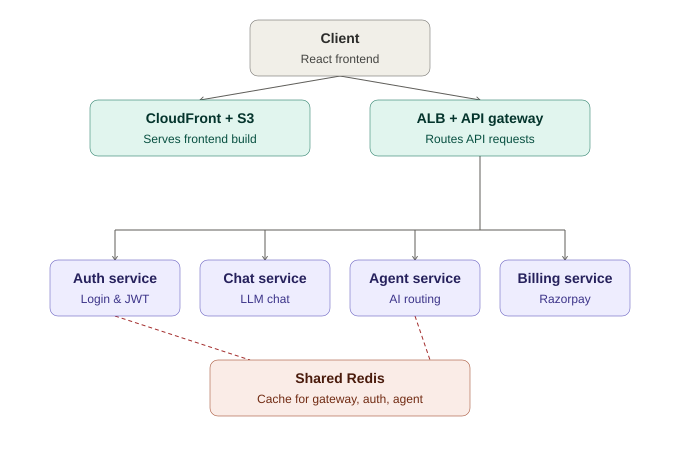

# [ChaatGPT](https://d2sxx6hi1j69nt.cloudfront.net/)

A microservice-based AI platform inspired by ChatGPT and DeepSeek — conversational AI, intelligent agent routing, web search, document generation, image generation, and subscription billing, deployed on AWS.


## Overview

[ChaatGPT](https://d2sxx6hi1j69nt.cloudfront.net/) is split into independent backend services rather than a single monolith, so each capability — auth, chat, agent routing, billing — can be developed, scaled, and deployed on its own.

**Capabilities**
- Conversational AI with intelligent agent routing
- Web search, PDF generation, PowerPoint generation, AI image generation, JS code generation
- Google Sign-In with JWT-based auth
- Razorpay subscription billing

## Architecture



The client talks to two entry points: **CloudFront + S3** for the static frontend build, and an **ALB + API gateway** for everything else. The gateway forwards requests to four independent services — **auth**, **chat**, **agent**, and **billing**.

A **shared Redis instance** (`backend/shared/redis`) is imported by the **gateway**, **auth**, and **agent** services for session storage, caching, and rate limiting, rather than each service running its own Redis client.

## Tech stack

| Layer | Stack |
|---|---|
| Frontend | React 19, Vite, Redux Toolkit, Tailwind CSS, Firebase |
| Backend | Node.js, Express, MongoDB, Redis, JWT, Firebase Admin SDK, Razorpay |
| DevOps | Docker, Docker Compose, GitHub Actions, AWS ECS/ECR/S3/CloudFront, ALB |

## Project structure

```
.
├── .github/workflows/deploy.yml
├── backend/
│   ├── gateway/
│   ├── services/
│   │   ├── auth/
│   │   ├── chat/
│   │   ├── agent/
│   │   └── billing/
│   ├── shared/
│   │   └── redis/          # shared Redis client used by gateway, auth, agent
│   └── docker-compose.yml
└── frontend/
```

## CI/CD

Pushes to `main` trigger GitHub Actions:
- **Backend** — build Docker images, push to ECR, force ECS redeploy
- **Frontend** — build the React app, upload to S3, invalidate CloudFront

## Roadmap

- Real-time streaming responses
- Team workspaces
- Rate limiting & usage analytics
- Multi-model support
- Voice assistant

## License

MIT

## Author

**Sk Md Jeesan**

If you found this project helpful, consider giving it a star on GitHub.